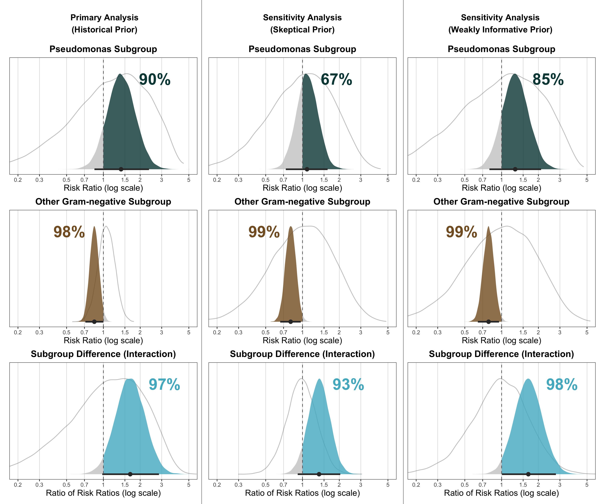

```{r setup}
pacman::p_load(rio, dplyr, brms, metafor, tidybayes, ggplot2, ggdist,
               patchwork, knitr, tibble, tidyr, gt, marginaleffects)

theme_set(
  theme(
    plot.title.position = 'plot',
    axis.ticks.x = element_blank(),
    axis.ticks.y = element_blank(),
    axis.text.x = element_text(size = 12),
    axis.text.y = element_text(size = 12),
    axis.title.x = element_text(size = 14),
    panel.background = element_blank(),
    panel.grid.major.x = element_line(color = "gray80", linewidth = 0.3)
  )
)
```

## Research Questions

The primary treatment effect of interest is whether there is a difference in **all-cause mortality** between **7-day vs. 14-day** antibiotic duration in patients with gram-negative bacteremia.

The secondary question is whether this treatment effect differs between two clinically important subgroups: patients with **Other Gram-negative** infections and patients with **Pseudomonas only** infections. Pseudomonas aeruginosa is an intrinsically resistant organism for which shorter treatment courses may be insufficient, making this subgroup distinction clinically relevant.

## Data

```{r data}
dat <- import("pseudomonas_data.xlsx")

dat |>
  select(study, subgroup, seven_events, seven_total, fourteen_events, fourteen_total) |>
  mutate(
    subgroup = ifelse(subgroup == "No Pseudomonas",
                      "Other Gram-negative", "Pseudomonas aeruginosa"),
    study = case_when(
      study == "Yahav 2019 no Pseudomonas"   ~ "Yahav 2019",
      study == "Yahav 2019 Pseudomonas Only" ~ "Yahav 2019",
      study == "BALANCE no Pseudomonas"      ~ "BALANCE",
      study == "BALANCE Pseudomonas only"    ~ "BALANCE",
      TRUE ~ study
    )
  ) |>
  arrange(desc(subgroup), study) |>
  gt(groupname_col = "subgroup") |>
  tab_header(
    title = "Available trial data on 7-day vs 14-day antibiotic duration"
  ) |>
  cols_label(
    study = "Study",
    seven_events = "Events",
    seven_total = "Total",
    fourteen_events = "Events",
    fourteen_total = "Total"
  ) |>
  tab_spanner(label = "7-day", columns = c(seven_events, seven_total)) |>
  tab_spanner(label = "14-day", columns = c(fourteen_events, fourteen_total)) |>
  tab_style(
    style = cell_text(weight = "bold"),
    locations = cells_row_groups()
  )
```

The dataset contains aggregate-level data from randomized controlled trials comparing 7-day to 14-day antibiotic therapy for gram-negative bacteremia. Three trials --- Yahav 2019, von Dach 2020, and Molina 2022 --- provide data for the Other Gram-negative subgroup. Only the Yahav 2019 trial reports outcomes separately for the Pseudomonas subgroup, providing the only source of external evidence on the interaction between pathogen type and treatment duration. The BALANCE trial, the largest in the dataset, reports results for both subgroups and is the focus of this reanalysis.

The figure below shows the crude odds ratios (7-day vs 14-day) from all studies, organized by subgroup. No pooling is performed here --- each point represents an individual study estimate.

```{r forest-plot-subgroups, fig.height=6, fig.width=9}
es_all <- escalc(
  measure = "OR",
  ai = seven_events, bi = seven_total - seven_events,
  ci = fourteen_events, di = fourteen_total - fourteen_events,
  data = dat
)

no_pseudo_idx <- which(dat$subgroup == "No Pseudomonas")
pseudo_idx    <- which(dat$subgroup == "Only Pseudomonas")

es_ordered <- es_all[c(no_pseudo_idx, pseudo_idx), ]
dat_ordered <- dat[c(no_pseudo_idx, pseudo_idx), ]

n_no_pseudo <- length(no_pseudo_idx)
n_pseudo    <- length(pseudo_idx)

rows_no_pseudo <- 1:n_no_pseudo
rows_pseudo    <- (n_no_pseudo + 3):(n_no_pseudo + 2 + n_pseudo)

par(mar = c(4, 0, 2, 2))

forest(es_ordered$yi, es_ordered$vi,
       slab = dat_ordered$study,
       atransf = exp,
       xlab = "Odds Ratio (7-day vs 14-day)",
       header = TRUE,
       refline = 0,
       at = log(c(0.1, 0.25, 0.5, 1, 2, 4, 10)),
       ylim = c(0.5, n_no_pseudo + n_pseudo + 6),
       rows = c(rows_no_pseudo, rows_pseudo),
       xlim = c(-5, 5))

text(-5, n_no_pseudo + 1, "Other Gram-negative", pos = 4, font = 2)
text(-5, n_no_pseudo + n_pseudo + 3, "Pseudomonas Only", pos = 4, font = 2)
```

## The Bernoulli Model

We model individual-level binary outcomes (death vs. survival) using a Bernoulli likelihood with a logit link. The aggregate trial data from BALANCE is expanded into patient-level records, where $y_i \in \{0, 1\}$ denotes the outcome for patient $i$.

The model is specified as:

$$
y_i \sim \text{Bernoulli}(p_i)
$$
$$
\text{logit}(p_i) = \beta_0 + \beta_1 \cdot \text{treat}_i + \beta_2 \cdot \text{pseudo}_i + \beta_3 \cdot (\text{treat}_i \times \text{pseudo}_i)
$$

where:

- $\beta_0$ (Intercept): log-odds of mortality for Other Gram-negative patients on 14-day treatment (reference group)
- $\beta_1$ (treat): treatment effect of 7-day vs 14-day in the Other Gram-negative subgroup (log odds ratio)
- $\beta_2$ (pseudo): difference in baseline mortality risk between Pseudomonas and Other Gram-negative patients (within the 14-day arm)
- $\beta_3$ (treat $\times$ pseudo): interaction term --- how much the treatment effect differs in the Pseudomonas subgroup relative to Other Gram-negative

The treatment effect in the Pseudomonas subgroup is $\beta_1 + \beta_3$.

In `brms`, we use the parameterization `y ~ 0 + Intercept + treat * pseudo`, which treats the intercept as a regular population-level coefficient. This is required so that the joint prior draws for the intercept are returned on the raw (unadjusted) scale --- needed downstream for the risk-ratio pipeline.

### Interpreting the Interaction as a Ratio of Odds Ratios

The interaction parameter $\beta_3$ has a natural interpretation on the odds ratio scale. Let $\text{OR}_{\text{no pseudo}}$ denote the odds ratio for treatment (7-day vs 14-day) in the Other Gram-negative subgroup, and $\text{OR}_{\text{pseudo}}$ the corresponding odds ratio in the Pseudomonas subgroup. On the log scale:

$$
\log(\text{OR}_{\text{no pseudo}}) = \beta_1
$$
$$
\log(\text{OR}_{\text{pseudo}}) = \beta_1 + \beta_3
$$

Therefore:

$$
\beta_3 = \log(\text{OR}_{\text{pseudo}}) - \log(\text{OR}_{\text{no pseudo}}) = \log\!\left(\frac{\text{OR}_{\text{pseudo}}}{\text{OR}_{\text{no pseudo}}}\right)
$$

Exponentiating, $\exp(\beta_3)$ is the **ratio of odds ratios** (ROR) between the two subgroups. A ROR of 1 (i.e., $\beta_3 = 0$) means the treatment effect is identical across subgroups. A ROR greater than 1 means that shorter treatment is relatively worse (higher odds of mortality) in the Pseudomonas subgroup compared to the Other Gram-negative subgroup. This is the key quantity for assessing effect modification by pathogen type.

```{r expand-data}
balance <- dat |> filter(grepl("BALANCE", study))

expand_arm <- function(events, total, treat, pseudo) {
  y <- c(rep(1L, events), rep(0L, total - events))
  data.frame(y = y, treat = treat, pseudo = pseudo)
}

balance_long <- bind_rows(
  expand_arm(
    events = balance$fourteen_events[balance$subgroup == "No Pseudomonas"],
    total  = balance$fourteen_total[balance$subgroup == "No Pseudomonas"],
    treat  = 0L, pseudo = 0L
  ),
  expand_arm(
    events = balance$seven_events[balance$subgroup == "No Pseudomonas"],
    total  = balance$seven_total[balance$subgroup == "No Pseudomonas"],
    treat  = 1L, pseudo = 0L
  ),
  expand_arm(
    events = balance$fourteen_events[balance$subgroup == "Only Pseudomonas"],
    total  = balance$fourteen_total[balance$subgroup == "Only Pseudomonas"],
    treat  = 0L, pseudo = 1L
  ),
  expand_arm(
    events = balance$seven_events[balance$subgroup == "Only Pseudomonas"],
    total  = balance$seven_total[balance$subgroup == "Only Pseudomonas"],
    treat  = 1L, pseudo = 1L
  )
)

cat("Total patients:", nrow(balance_long), "\n\n")
cat("Patients by group:\n")
print(table(treat = balance_long$treat, pseudo = balance_long$pseudo))
cat("\nEvent rates:\n")
print(round(tapply(balance_long$y, list(treat = balance_long$treat, pseudo = balance_long$pseudo), mean), 3))
```

## Primary Analysis: Historical Priors

### Prior Derivation

The primary analysis uses data-derived historical priors for the treatment effect and interaction parameters, incorporating evidence from external trials.

**Treatment effect prior ($\beta_1$):** We conducted a random-effects meta-analysis (with Knapp-Hartung adjustment) of the log odds ratios from three external trials reporting the treatment effect in patients with Other Gram-negative infections: Yahav 2019 (Other Gram-negative arm), von Dach 2020, and Molina 2022. The pooled estimate and its standard error serve as the mean and standard deviation of the Normal prior for $\beta_1$.

```{r treatment-prior}
external_no_pseudo <- dat |>
  filter(study %in% c("von Dach 2020", "Molina 2022", "Yahav 2019 no Pseudomonas"))

es_no_pseudo <- escalc(
  measure = "OR",
  ai = seven_events, bi = seven_total - seven_events,
  ci = fourteen_events, di = fourteen_total - fourteen_events,
  data = external_no_pseudo
)

re_no_pseudo <- rma(yi, vi, slab = study, data = es_no_pseudo, test = "knha")

treat_prior_mean <- as.numeric(re_no_pseudo$beta)
treat_prior_sd   <- as.numeric(re_no_pseudo$se)

par(mar = c(4, 0, 2, 2))

forest(re_no_pseudo,
       atransf = exp,
       xlab = "Odds Ratio (7-day vs 14-day)",
       header = TRUE,
       refline = 0,
       at = log(c(0.1, 0.25, 0.5, 1, 2, 4, 10)),
       xlim = c(-6, 6))
```

**Interaction prior ($\beta_3$):** The only external evidence on the treatment-by-subgroup interaction comes from Yahav 2019, which reported outcomes separately for Pseudomonas and Other Gram-negative patients. The figure below shows the subgroup-specific odds ratios from Yahav 2019.

```{r yahav-forest, fig.height=3.5, fig.width=9}
yahav_dat <- dat |> filter(grepl("Yahav", study))

es_yahav_plot <- escalc(
  measure = "OR",
  ai = seven_events, bi = seven_total - seven_events,
  ci = fourteen_events, di = fourteen_total - fourteen_events,
  data = yahav_dat
)

par(mar = c(4, 0, 2, 2))

forest(es_yahav_plot$yi, es_yahav_plot$vi,
       slab = c("Yahav 2019 — Other Gram-negative", "Yahav 2019 — Pseudomonas Only"),
       atransf = exp,
       xlab = "Odds Ratio (7-day vs 14-day)",
       header = TRUE,
       refline = 0,
       at = log(c(0.1, 0.25, 0.5, 1, 2, 4, 10)),
       xlim = c(-6, 6),
       ylim = c(0.5, 5))
```

The interaction is estimated as the difference between the two subgroup-specific log odds ratios, following the method of Altman & Bland (BMJ 2003; DOI: 10.1136/bmj.326.7382.219):

$$
\hat{\beta}_3 = \log(\text{OR}_{\text{pseudo}}) - \log(\text{OR}_{\text{no pseudo}})
$$

$$
\text{SE}(\hat{\beta}_3) = \sqrt{V_{\text{pseudo}} + V_{\text{no pseudo}}}
$$

where $V$ denotes the sampling variance of each subgroup-specific log-OR. This yields a Normal prior for $\beta_3$ centered at the observed interaction with uncertainty reflecting both subgroup estimates.

**Other parameters:** The intercept ($\beta_0$) and baseline Pseudomonas effect ($\beta_2$) receive weakly informative Normal(0, 1.5) priors, which on the logit scale cover a wide but not implausible range of baseline risks.

```{r interaction-prior}
yahav <- dat |> filter(grepl("Yahav", study))

es_yahav <- escalc(
  measure = "OR",
  ai = seven_events, bi = seven_total - seven_events,
  ci = fourteen_events, di = fourteen_total - fourteen_events,
  data = yahav
)

yahav_no_pseudo <- es_yahav |> filter(subgroup == "No Pseudomonas")
yahav_pseudo    <- es_yahav |> filter(subgroup == "Only Pseudomonas")

interaction_mean <- as.numeric(yahav_pseudo$yi - yahav_no_pseudo$yi)
interaction_sd   <- sqrt(as.numeric(yahav_pseudo$vi + yahav_no_pseudo$vi))
```

```{r prior-table}
prior_summary <- tibble(
  Parameter = c("Intercept (β₀)", "Treatment (β₁)", "Pseudomonas baseline (β₂)", "Interaction (β₃)"),
  Prior = c(
    "Normal(0, 1.5)",
    sprintf("Normal(%.2f, %.2f)", treat_prior_mean, treat_prior_sd),
    "Normal(0, 1.5)",
    sprintf("Normal(%.2f, %.2f)", interaction_mean, interaction_sd)
  ),
  Source = c(
    "Weakly informative",
    "Meta-analysis: Yahav 2019, von Dach 2020, Molina 2022",
    "Weakly informative",
    "Yahav 2019 (Pseudomonas vs Other Gram-negative)"
  )
)
kable(prior_summary, caption = "Prior specifications for the historical model")
```

The model was fit in `brms` with the `0 + Intercept + treat * pseudo` parameterization, 4 chains, 10,000 iterations per chain (5,000 warmup), `adapt_delta = 0.95`, and `sample_prior = "yes"` so that prior draws are available alongside the posterior. The fit is cached at `fits/primary.rds`.

### Posterior Results

```{r informative-posterior-fit, results='hide'}
balance_fit <- readRDS("fits/primary.rds")
```

#### Diagnostics

Trace plots show the four MCMC chains exploring the parameter space and confirmed well-mixing chains.

```{r informative-trace, fig.height=6}
plot(balance_fit)
```

Posterior predictive checks compare the observed event rate (dark line) to the distribution of event rates predicted by the model (light histograms), separately for each treatment-by-subgroup combination. The observed statistic falls within the bulk of the simulated distribution, confirming the model's adequacy.

```{r informative-ppcheck, fig.height=5}
balance_fit$data$treat_pseudo <- interaction(
  ifelse(balance_fit$data$treat, "7-day", "14-day"),
  ifelse(balance_fit$data$pseudo, "Pseudomonas", "Other Gram-negative"),
  sep = " / "
)

pp_check(balance_fit, "stat_grouped", group = "treat_pseudo") +
  labs(x = "Death probability")
```

```{r informative-summary}
summary(balance_fit)
```

## Sensitivity Analysis: Skeptical Prior

To further assess robustness, we fit a second model using skeptical priors for both the treatment effect and the interaction term. Both priors are centered at zero, replacing the data-derived historical prior for the treatment effect used in the primary analysis. The treatment effect receives a Normal(0, 0.71) prior, and the interaction receives a tighter Normal(0, 0.36) prior. This tests whether the signal of differential treatment effect persists when prior information actively downweights both large overall effects and subgroup differences.

A Normal(0, 0.71) prior on the log-OR scale places 95% of prior mass on ORs between approximately 0.25 and 4.0. A Normal(0, 0.36) prior on the log-ROR scale places 95% of prior mass on RORs between approximately 0.49 and 2.03, meaning the prior considers it very unlikely a priori that the treatment effect in one subgroup would be more than double that in the other.

```{r skeptic-prior-table}
skeptic_prior_summary <- tibble(
  Parameter = c("Intercept (β₀)", "Treatment (β₁)", "Pseudomonas baseline (β₂)", "Interaction (β₃)"),
  Prior = c(
    "Normal(0, 1.5)",
    "Normal(0, 0.71)",
    "Normal(0, 1.5)",
    "Normal(0, 0.36)"
  ),
  Rationale = c(
    "Same as primary analysis",
    "SD of 0.71 places 95% prior mass on ORs between ~0.25 and ~4 — skeptical of large treatment effects",
    "Same as primary analysis",
    "SD of 0.36 places 95% prior mass on RORs between ~0.49 and ~2.03 — skeptical of subgroup differences"
  )
)
kable(skeptic_prior_summary, caption = "Prior specifications for the skeptical sensitivity analysis")
```

The fit is cached at `fits/skeptic.rds`.

### Posterior Results

```{r skeptic-posterior-fit, results='hide'}
skeptic_fit <- readRDS("fits/skeptic.rds")
```

#### Diagnostics

```{r skeptic-trace, fig.height=6}
plot(skeptic_fit)
```

```{r skeptic-ppcheck, fig.height=5}
skeptic_fit$data$treat_pseudo <- interaction(
  ifelse(skeptic_fit$data$treat, "7-day", "14-day"),
  ifelse(skeptic_fit$data$pseudo, "Pseudomonas", "Other Gram-negative"),
  sep = " / "
)

pp_check(skeptic_fit, "stat_grouped", group = "treat_pseudo") +
  labs(x = "Death probability")
```

Trace plots and posterior predictive checks for the skeptical model show good mixing and calibration.

```{r skeptic-posterior-summary}
summary(skeptic_fit)
```

## Sensitivity Analysis: Weakly Informative Priors

As a further sensitivity analysis, we fit a third model replacing the data-derived historical priors with weakly informative priors centered at zero (i.e., no prior directional information).

```{r weak-prior-table}
weak_prior_summary <- tibble(
  Parameter = c("Intercept (β₀)", "Treatment (β₁)", "Pseudomonas baseline (β₂)", "Interaction (β₃)"),
  Prior = c("Normal(0, 1.5)", "Normal(0, 0.82)", "Normal(0, 1.5)", "Normal(0, 0.71)"),
  Rationale = c(
    "Same as primary analysis",
    "SD of 0.82 places 95% prior mass on ORs between ~0.2 and ~5",
    "Same as primary analysis",
    "SD of 0.71 places 95% prior mass on RORs between ~0.25 and ~4"
  )
)
kable(weak_prior_summary, caption = "Prior specifications for the sensitivity analysis")
```

Both priors are symmetric and centered at the null (OR = 1), reflecting agnosticism about the direction of the treatment effect and interaction. The fit is cached at `fits/sensitivity.rds`.

### Posterior Results

```{r weak-posterior-fit, results='hide'}
weak_fit <- readRDS("fits/sensitivity.rds")
```

#### Diagnostics

```{r weak-trace, fig.height=6}
plot(weak_fit)
```

```{r weak-ppcheck, fig.height=5}
weak_fit$data$treat_pseudo <- interaction(
  ifelse(weak_fit$data$treat, "7-day", "14-day"),
  ifelse(weak_fit$data$pseudo, "Pseudomonas", "Other Gram-negative"),
  sep = " / "
)

pp_check(weak_fit, "stat_grouped", group = "treat_pseudo") +
  labs(x = "Death probability")
```

Trace plots and posterior predictive checks for the weakly informative model show similarly good mixing and calibration, confirming that the choice of prior does not introduce pathological behaviour in the sampling.

```{r weak-posterior-summary}
summary(weak_fit)
```

## Posterior Comparison Across Models — Odds Ratio Scale

The figure below compares the posterior distributions across all three prior specifications (historical, skeptical, weakly informative) for three estimands: the treatment effect in the Pseudomonas subgroup, the treatment effect in the Other Gram-negative subgroup, and the interaction (ratio of odds ratios). Each panel overlays the prior (gray outline) on the posterior (filled), with the posterior probability of harm/benefit annotated.

```{r figure-letter-or, out.width="100%"}
knitr::include_graphics("figures/figure_letter.png")
```

The interaction posteriors (ratio of odds ratios) are concordant across all three models, indicating that the signal of effect modification by pathogen type is robust to the choice of prior. The subgroup-specific posteriors are also concordant between the primary (historical) and weakly informative models, but the skeptical model — which replaces the historical treatment-effect prior with a null-centered Normal(0, 0.71) — shifts the Other Gram-negative subgroup posterior toward what the BALANCE data alone supports. This is expected: the historical prior was contributing substantial information to that subgroup in the primary analysis, and removing it lets BALANCE drive the estimate.

## Posterior Results — Risk Ratio Scale

While the model is parameterized on the log-odds scale, the risk ratio is often more clinically interpretable. **Posterior** subgroup-specific risk ratios are computed via `marginaleffects::avg_comparisons()` with `comparison = "lnratioavg"` and `by = "pseudo"`, which returns the posterior of

$$
\log \text{RR}_{\text{subgroup}}
= \log\!\left(
\frac{\overline{P}(Y = 1 \mid \text{treat} = 1, \text{subgroup})}
     {\overline{P}(Y = 1 \mid \text{treat} = 0, \text{subgroup})}
\right)
$$

within each `pseudo` level. The ratio of risk ratios (RoRR) is formed as $\text{RR}_{\text{pseudo}} / \text{RR}_{\text{no pseudo}}$ on the draws. Because the model contains no covariates other than `treat` and `pseudo`, the within-cell average reduces to the cell prediction itself, so this is algebraically identical to the manual `predictions()`-based ratio used in earlier drafts (verified numerically; see `test_rr_avg_comparisons.R`).

The **prior** on the RR scale is visualised by transforming the analyst-specified prior on the log-OR (and on the interaction) through a *fixed* baseline event rate — the observed BALANCE 14-day arm rate in each subgroup. This fixed-baseline construction (see `get_prior_logrr_draws()` in `analysis.R`) avoids the spiky mixture that would arise from marginalising the wide `Normal(0, 1.5)` prior on the raw intercept through `plogis()`, and isolates what the analyst's belief about the log-OR effect implies for the risk ratio at a clinically realistic baseline.

### Translating priors to the risk-ratio scale

Because the model is parameterized on the log-odds scale but the results are reported on the risk-ratio scale, each prior must be re-expressed as an implied prior on the RR (for the subgroup treatment effect) and on the RoRR — ratio of risk ratios — (for the interaction). We use the closed-form fixed-baseline conversion of Zhang & Yu (*JAMA* 1998; doi:10.1001/jama.280.19.1690):

$$
\text{RR} = \frac{\text{OR}}{p_0\,(\text{OR} - 1) + 1}
$$

with $p_0$ set to the BALANCE 14-day event rate in the relevant subgroup: 15.4% (180/1172) in the Other Gram-negative subgroup for the treatment-effect prior, and 20.5% (17/83) in the Pseudomonas subgroup for the interaction (RoRR) prior. For each Normal($\mu$, $\sigma$) prior on the log-OR scale we push the median ($\mu$) and the 95% endpoints ($\mu \pm 1.96\,\sigma$) through this map, with $\text{OR} = \exp(\text{log-OR})$.

The treatment-effect RR uses log-OR $= \beta_{\text{treat}}$ at $p_0^{\text{no pseudo}} = 0.154$. The RoRR is the ratio of the two subgroup risk ratios,

$$
\text{RoRR}
= \frac{\text{RR}_{\text{pseudo}}}{\text{RR}_{\text{no pseudo}}},
$$

where $\text{RR}_{\text{no pseudo}}$ is obtained from log-OR $= \beta_{\text{treat}}$ at $p_0^{\text{no pseudo}}$ and $\text{RR}_{\text{pseudo}}$ from log-OR $= \beta_{\text{treat}} + \beta_{\text{int}}$ at $p_0^{\text{pseudo}} = 0.205$. The interaction prior supplies $\beta_{\text{int}}$; we evaluate the conversion with $\beta_{\text{treat}}$ held at the paired treat prior's mean (0.07 for the historical model; 0 for the skeptical and weakly informative models), so the RoRR reflects the joint prior median actually assumed by each model.

Doi *et al.* (*J Clin Epidemiol* 2020; doi:10.1016/j.jclinepi.2020.08.019) endorse this fixed-baseline construction for translating prior or posterior OR-scale limits to the RR scale. The code lives in Step 11 of `analysis.R`.

```{r prior-rr-summary-prep}
# Re-derive the same inputs the analysis script computes in Step 1 + Step 10
# so this report stays self-contained (no source("analysis.R") needed).
external_no_pseudo <- dat |>
  filter(study %in% c("von Dach 2020", "Molina 2022", "Yahav 2019 no Pseudomonas"))
es_no_pseudo <- escalc(
  measure = "OR",
  ai = seven_events, bi = seven_total - seven_events,
  ci = fourteen_events, di = fourteen_total - fourteen_events,
  data = external_no_pseudo
)
re_no_pseudo <- rma(yi, vi, data = es_no_pseudo, test = "knha")
treat_prior_mean <- as.numeric(re_no_pseudo$beta)
treat_prior_sd   <- as.numeric(re_no_pseudo$se)

yahav <- dat |> filter(grepl("Yahav", study))
es_yahav <- escalc(
  measure = "OR",
  ai = seven_events, bi = seven_total - seven_events,
  ci = fourteen_events, di = fourteen_total - fourteen_events,
  data = yahav
)
yahav_no_pseudo <- es_yahav |> filter(subgroup == "No Pseudomonas")
yahav_pseudo    <- es_yahav |> filter(subgroup == "Only Pseudomonas")
interaction_mean <- as.numeric(yahav_pseudo$yi - yahav_no_pseudo$yi)
interaction_sd   <- sqrt(as.numeric(yahav_pseudo$vi + yahav_no_pseudo$vi))

balance <- dat |> filter(grepl("BALANCE", study))
baseline_no_pseudo <- balance$fourteen_events[balance$subgroup == "No Pseudomonas"] /
                     balance$fourteen_total [balance$subgroup == "No Pseudomonas"]
baseline_pseudo    <- balance$fourteen_events[balance$subgroup == "Only Pseudomonas"] /
                     balance$fourteen_total [balance$subgroup == "Only Pseudomonas"]

or_prior_to_rr <- function(mu, sigma, p0) {
  q975 <- qnorm(0.975)
  list(
    med = plogis(qlogis(p0) + mu) / p0,
    lo  = plogis(qlogis(p0) + mu - q975 * sigma) / p0,
    hi  = plogis(qlogis(p0) + mu + q975 * sigma) / p0
  )
}
interaction_prior_to_rorr <- function(mu_int, sigma_int, mu_treat,
                                      p0_no_pseudo, p0_pseudo) {
  q975 <- qnorm(0.975)
  rr_no_pseudo <- plogis(qlogis(p0_no_pseudo) + mu_treat) / p0_no_pseudo
  rr_p <- function(b_int) plogis(qlogis(p0_pseudo) + mu_treat + b_int) / p0_pseudo
  list(
    med = rr_p(mu_int) / rr_no_pseudo,
    lo  = rr_p(mu_int - q975 * sigma_int) / rr_no_pseudo,
    hi  = rr_p(mu_int + q975 * sigma_int) / rr_no_pseudo
  )
}

hist_treat_rr         <- or_prior_to_rr(treat_prior_mean, treat_prior_sd, baseline_no_pseudo)
hist_interaction_rorr <- interaction_prior_to_rorr(
  interaction_mean, interaction_sd, treat_prior_mean,
  baseline_no_pseudo, baseline_pseudo
)
skeptic_treat_rr         <- or_prior_to_rr(0, 0.71, baseline_no_pseudo)
skeptic_interaction_rorr <- interaction_prior_to_rorr(0, 0.36, 0, baseline_no_pseudo, baseline_pseudo)
weak_treat_rr            <- or_prior_to_rr(0, 0.82, baseline_no_pseudo)
weak_interaction_rorr    <- interaction_prior_to_rorr(0, 0.71, 0, baseline_no_pseudo, baseline_pseudo)

fmt_med_ci <- function(x) sprintf("%.2f (%.2f - %.2f)", x$med, x$lo, x$hi)

prior_rr_summary <- tibble::tibble(
  Model = c("Historical (primary)", "Skeptical", "Weakly informative"),
  `Treatment effect, RR (median, 95% interval)` = c(
    fmt_med_ci(hist_treat_rr),
    fmt_med_ci(skeptic_treat_rr),
    fmt_med_ci(weak_treat_rr)
  ),
  `Interaction, RoRR (median, 95% interval)` = c(
    fmt_med_ci(hist_interaction_rorr),
    fmt_med_ci(skeptic_interaction_rorr),
    fmt_med_ci(weak_interaction_rorr)
  )
)
```

```{r prior-rr-summary-table}
kable(prior_rr_summary, caption = "Analyst-specified priors translated to the RR / RoRR scale via the Zhang & Yu fixed-baseline conversion (Other Gram-negative baseline 15.4% for the treatment effect; Pseudomonas baseline 20.5% for the interaction).")
```

```{r figure-letter-rr, out.width="100%"}

```

::: {.callout-note}
## Why the prior slab in the Pseudomonas panel does not visually peak at RR = 1

All priors are specified on the log-odds scale and are centered at the null (log-OR = 0). For each posterior draw, the implied log-RR is obtained via the fixed-baseline Zhang & Yu map, $\text{log-RR} = \log\!\big(\text{plogis}(\text{logit}(p_0) + \text{log-OR}) / p_0\big)$. This map is monotonic but strongly nonlinear: as log-OR grows, log-RR saturates at the ceiling $\log(1/p_0)$, while as log-OR shrinks, log-RR is unbounded below. A symmetric Normal on log-OR therefore maps to a left-skewed distribution on log-RR — the *median* stays at RR = 1 (since the map sends 0 to 0), but the *mode* and the bulk of the density shift toward the ceiling. The effect is most visible in the Pseudomonas subgroup because the combined treatment + interaction prior is wide (e.g.\ SD $\approx \sqrt{0.82^2 + 0.71^2} \approx 1.08$ in the weakly informative model) and the Pseudomonas baseline rate (20.5%) places the ceiling $\log(1/0.205) \approx 1.59$ inside the plotted x-axis range, so the prior mass piles up against it. The displayed slab is therefore expected to look off-center even though the prior median is exactly at RR = 1.
:::

Findings on the risk-ratio scale mirror the odds-ratio results: the interaction (RoRR) posterior is concordant across all three priors and the qualitative direction of effect modification by pathogen type is preserved, while the Other Gram-negative subgroup posterior under the skeptical prior reflects the BALANCE data more directly than the historical-prior models.
