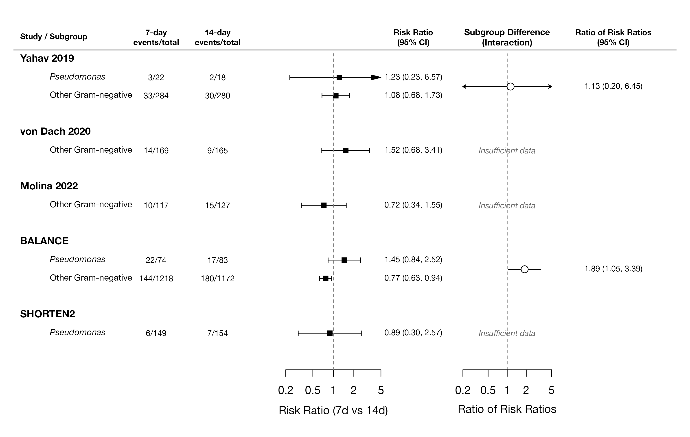
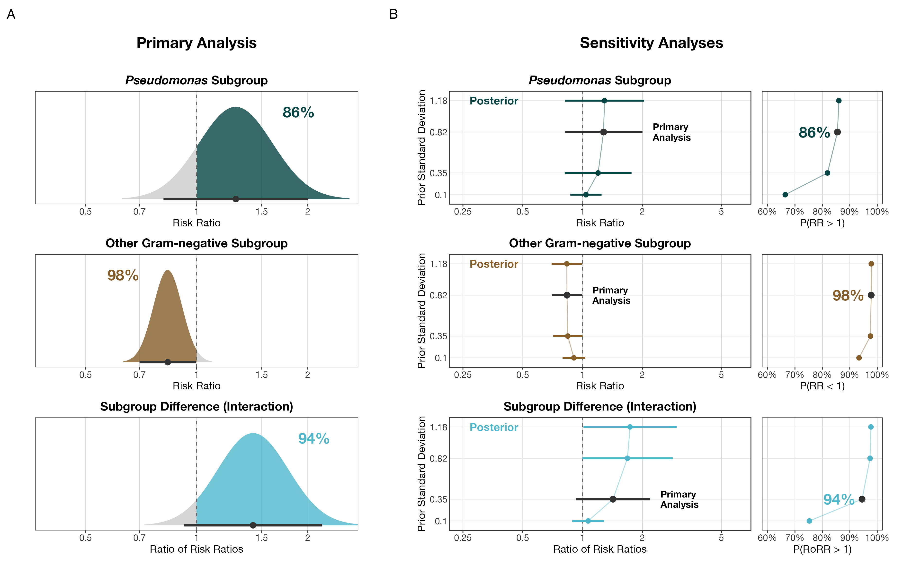

```{r setup}
pacman::p_load(
  rio, dplyr, purrr, metafor,
  ggplot2, ggdist, patchwork, tibble, tidyr, MetBrewer,
  knitr, gt, glue
)
```

## 1. Background and Research Questions

**Clinical question.** Should gram-negative bacteremia be treated for 7 days or 14 days? Several large randomised trials — Yahav 2019, BALANCE, von Dach 2020, Molina 2022, and SHORTEN2 — have compared these durations, but none was individually powered to detect whether the answer differs by pathogen. 

**Statistical question.** Is there a treatment–pathogen interaction, i.e. does the 7-day vs. 14-day risk ratio for all-cause mortality differ between (a) patients infected with *Pseudomonas aeruginosa* and (b) patients infected with other gram-negative organisms? Pooling across trials increases power to detect such an interaction — but only if the analysis is conducted correctly.

---

## 2. Data

```{r load-data}
dat <- import("pseudomonas_data.xlsx")

shorten2 <- tibble(
  study = "SHORTEN2", subgroup = "Only Pseudomonas",
  seven_events = 6L, seven_total = 149L,
  fourteen_events = 7L, fourteen_total = 154L
)

dat <- bind_rows(dat, shorten2) |>
  mutate(
    study = case_when(
      grepl("Yahav",   study) ~ "Yahav 2019",
      grepl("BALANCE", study) ~ "BALANCE",
      TRUE ~ study
    ),
    sublab = ifelse(subgroup == "Only Pseudomonas",
                    "Pseudomonas aeruginosa", "Other Gram-negative")
  )
```

```{r data-table}
dat |>
  select(study, sublab, seven_events, seven_total,
         fourteen_events, fourteen_total) |>
  arrange(sublab, study) |>
  mutate(
    rate_7d  = sprintf("%.1f%%", 100 * seven_events / seven_total),
    rate_14d = sprintf("%.1f%%", 100 * fourteen_events / fourteen_total)
  ) |>
  gt(groupname_col = "sublab") |>
  tab_header(
    title    = md("**Trial data: 7-day vs. 14-day antibiotic duration**"),
    subtitle = "Outcome: all-cause mortality"
  ) |>
  cols_label(
    study            = "Trial",
    seven_events     = "Events",
    seven_total      = "Total",
    rate_7d          = "Rate",
    fourteen_events  = "Events",
    fourteen_total   = "Total",
    rate_14d         = "Rate"
  ) |>
  tab_spanner(label = "7-day arm",  columns = c(seven_events,    seven_total,    rate_7d)) |>
  tab_spanner(label = "14-day arm", columns = c(fourteen_events, fourteen_total, rate_14d)) |>
  tab_style(
    style     = cell_text(weight = "bold"),
    locations = cells_row_groups()
  ) |>
  tab_footnote(
    footnote  = "SHORTEN2 contributed the Pseudomonas stratum only; event counts were not in the source xlsx and were entered manually.",
    locations = cells_body(columns = study, rows = study == "SHORTEN2")
  )
```

**Trial matrix.** Five RCTs contribute data to this analysis:

| Trial | Other Gram-negative | *Pseudomonas* | Interaction estimable? |
|---|:---:|:---:|:---:|
| Yahav 2019 | ✓ | ✓ | **yes** |
| BALANCE | ✓ | ✓ | **yes** |
| von Dach 2020 | ✓ | — | no |
| Molina 2022 | ✓ | — | no |
| SHORTEN2 | — | ✓ | no |

Critically, only **Yahav 2019** and **BALANCE** provide both strata, so all within-trial information about the treatment–pathogen interaction comes from these two trials.

---

## 3. Analytical Framework

### 3.1 Two-stage IPD meta-analysis

We follow the two-stage framework for examining treatment–covariate interactions in IPD meta-analyses described by Riley et al. (*Statistics in Medicine*, 2020; DOI 10.1002/sim.8516). The key principle from that paper is:

> *"Interactions should be estimated directly, and not by calculating differences in meta-analysis results for subgroups … interaction estimates should be based solely on within-study information."* (Riley et al., §4.1–4.2)

Comparing subgroup-specific pooled estimates conflates within-trial and across-trial information, introducing aggregation (ecological) bias. The correct estimand of a treatment–covariate interaction is the difference in treatment effects **within each trial**, pooled across trials. Trials that observe only one subgroup contribute information about that subgroup's main effect but contribute **zero information** to the interaction.

We fit three separate Stage-2 models rather than a single omnibus model:

1. **Other Gram-negative subgroup** — pools the main treatment effect in patients without *Pseudomonas*.
2. ***Pseudomonas aeruginosa* subgroup** — pools the main treatment effect in patients with *Pseudomonas*.
3. **Within-trial interaction (subgroup difference)** — pools the within-trial log(RR) difference (Pseudomonas minus Other GN) across the two trials that provide both strata.

All three estimands are on the **risk ratio (RR) scale** throughout this report.

### 3.2 Stage 1: Within-trial effect sizes

For each trial $i$ and each available subgroup $s \in \{\text{Other GN},\, \text{Pseudomonas}\}$, we compute the log risk ratio and its sampling variance from the $2 \times 2$ table using `metafor::escalc(measure = "RR")`:

$$
\hat\theta_{is} = \log\!\Bigl(\widehat{\text{RR}}_{is}\Bigr)
= \log\!\left(\frac{a_{is}\,/\,(a_{is}+b_{is})}{c_{is}\,/\,(c_{is}+d_{is})}\right)
$$

$$
\hat{V}_{is}
= \frac{1}{a_{is}} - \frac{1}{a_{is}+b_{is}} + \frac{1}{c_{is}} - \frac{1}{c_{is}+d_{is}}
$$

where $a_{is}$ = events in the 7-day arm, $b_{is}$ = non-events in the 7-day arm, $c_{is}$ = events in the 14-day arm, $d_{is}$ = non-events in the 14-day arm.

The **within-trial interaction** for trials $i \in \{\text{Yahav 2019},\, \text{BALANCE}\}$ is constructed following Altman & Bland (*BMJ*, 2003):

$$
\hat\gamma_{Wi} = \hat\theta_{i,\text{Pseud}} - \hat\theta_{i,\text{Other GN}}
= \log\!\left(\frac{\text{RR}_{i,\text{Pseud}}}{\text{RR}_{i,\text{Other GN}}}\right)
= \log(\text{RoRR}_i)
$$

$$
\hat{V}_{Wi} = \hat{V}_{i,\text{Pseud}} + \hat{V}_{i,\text{Other GN}}
$$

Variances add because the two strata are independent within the same trial. This within-trial construction is exact for independent binary proportions; it is the Stage-1 analogue of the interaction parameter $\gamma_{Wi}$ in equation (2) of Riley et al.

```{r build-sets}
mk_es <- function(measure) {
  escalc(measure = measure,
         ai = seven_events, bi = seven_total - seven_events,
         ci = fourteen_events, di = fourteen_total - fourteen_events,
         data = dat)
}

build_sets <- function(measure) {
  es <- mk_es(measure)
  es$sei <- sqrt(es$vi)
  other <- es |> filter(subgroup == "No Pseudomonas")   |> select(study, yi, vi, sei)
  pseud <- es |> filter(subgroup == "Only Pseudomonas") |> select(study, yi, vi, sei)
  both  <- intersect(es$study[es$subgroup == "No Pseudomonas"],
                     es$study[es$subgroup == "Only Pseudomonas"])
  inter <- lapply(both, function(s) {
    p <- es[es$study == s & es$subgroup == "Only Pseudomonas", ]
    o <- es[es$study == s & es$subgroup == "No Pseudomonas", ]
    data.frame(study = s, yi = p$yi - o$yi, vi = p$vi + o$vi)
  }) |> bind_rows()
  inter$sei <- sqrt(inter$vi)
  list(other = as.data.frame(other),
       pseud = as.data.frame(pseud),
       inter = as.data.frame(inter))
}

S_rr <- build_sets("RR")
```

The Stage-1 inputs to the RR models are:

```{r stage1-table}
bind_rows(
  S_rr$other |> mutate(estimand = "Other Gram-negative"),
  S_rr$pseud |> mutate(estimand = "Pseudomonas aeruginosa"),
  S_rr$inter |> mutate(estimand = "Within-trial interaction (log RoRR)")
) |>
  mutate(
    rr_point = exp(yi),
    rr_lo    = exp(yi - 1.96 * sei),
    rr_hi    = exp(yi + 1.96 * sei),
    effect   = sprintf("%.2f (%.2f, %.2f)", rr_point, rr_lo, rr_hi)
  ) |>
  select(estimand, study, effect) |>
  gt(groupname_col = "estimand") |>
  tab_header(
    title = md("**Stage-1 trial-level estimates**"),
    subtitle = "Risk ratios (7-day vs. 14-day) or ratio of risk ratios (interaction), 95% CI"
  ) |>
  cols_label(study = "Trial", effect = "RR or RoRR (95% CI)") |>
  tab_style(
    style     = cell_text(weight = "bold"),
    locations = cells_row_groups()
  )
```

### 3.3 Stage 2: Bayesian Conjugate Normal-Normal Pooling

Rather than performing expensive Markov Chain Monte Carlo (MCMC) simulations, we implement the **exact, closed-form conjugate normal-normal updating method**. 

As detailed by Christian Röver (2020) in his *Journal of Statistical Software* paper (*bayesmeta: An R Package for Bayesian Random-Effects Meta-Analysis*, Equation 14), the likelihood of the observed trial-level effect sizes $y_i$ is modeled as normally distributed around a common pooled effect $\mu$:
$$y_i \mid \mu \sim \mathcal{N}(\mu, \sigma_i^2 + \tau^2)$$
where $\sigma_i^2$ is the known within-study variance, and $\tau^2$ is the between-study variance. For our fixed-effects models, the between-study heterogeneity is set to zero ($\tau^2 = 0$), so the likelihood simplifies to:
$$y_i \mid \mu \sim \mathcal{N}(\mu, \sigma_i^2)$$

We specify a normal prior distribution on the pooled effect $\mu$ with prior mean $\mu_p$ and prior variance $\sigma_p^2$:
$$\mu \sim \mathcal{N}(\mu_p, \sigma_p^2)$$

Because a normal likelihood combined with a normal prior is conjugate, the posterior distribution $\mu \mid \vec{y}, \vec{\sigma}$ is also exactly normal:
$$\mu \mid \vec{y}, \vec{\sigma} \sim \mathcal{N}(\hat{\mu}, \hat{\sigma}^2)$$

The posterior mean $\hat{\mu}$ and posterior variance $\hat{\sigma}^2$ are solved analytically:
$$\hat{\mu} = \frac{\frac{\mu_p}{\sigma_p^2} + \sum_{i=1}^k \frac{y_i}{\sigma_i^2}}{\frac{1}{\sigma_p^2} + \sum_{i=1}^k \frac{1}{\sigma_i^2}}$$

$$\hat{\sigma}^2 = \frac{1}{\frac{1}{\sigma_p^2} + \sum_{i=1}^k \frac{1}{\sigma_i^2}}$$

In our analysis, the prior is centered at the null ($\mu_p = 0$). This simplifies the posterior equations to:
$$\hat{\mu} = \hat{\sigma}^2 \sum_{i=1}^k \frac{y_i}{\sigma_i^2} \qquad \text{and} \qquad \hat{\sigma}^2 = \frac{1}{\frac{1}{\sigma_p^2} + \sum_{i=1}^k \frac{1}{\sigma_i^2}}$$

#### Mathematical Mapping to the `conj()` Function
This mathematical model is implemented directly in R inside the `conj()` function using the following mapping:
```R
conj <- function(d, tau) {
  w <- 1 / d$sei^2
  A <- sum(w); B <- sum(d$yi * w)
  v <- 1 / (1 / tau^2 + A)
  list(m = v * B, sd = sqrt(v))
}
```

* **Study Weights ($w_i = \frac{1}{\sigma_i^2}$)**: Defined in R as `w <- 1 / d$sei^2`.
* **Sum of Study Precisions ($A = \sum_{i=1}^k \frac{1}{\sigma_i^2}$)**: Represented by `A <- sum(w)`.
* **Precision-Weighted Sum of Data ($B = \sum_{i=1}^k \frac{y_i}{\sigma_i^2}$)**: Represented by `B <- sum(d$yi * w)`.
* **Prior Precision ($\frac{1}{\sigma_p^2}$)**: Represented by `1 / tau^2` (where `tau` is the prior standard deviation $\sigma_p$).
* **Posterior Variance ($\hat{\sigma}^2$)**: Represented by `v <- 1 / (1 / tau^2 + A)`.
* **Posterior Mean ($\hat{\mu}$)**: Represented by `m = v * B`, which is algebraically identical to $\hat{\sigma}^2 \sum \frac{y_i}{\sigma_i^2}$.
* **Posterior Standard Error ($\hat{\sigma}$)**: Represented by `sd = sqrt(v)`.

Using these exact moments, we calculate the posterior cumulative probabilities and credible intervals analytically using R's built-in `pnorm()` and `qnorm()` functions.

### 3.4 Prior specification

Priors were pre-specified for the pooled effect parameter.

**Pooled effect (Intercept, $\mu$).** The two subgroup models (Other GN, Pseudomonas) use $\sigma_p = 0.82$. On the ratio scale, $\exp(\pm 1.96 \times 0.82) \approx (0.20,\, 5.0)$, covering the full clinically plausible range for an antibiotic-duration main effect. The **interaction model uses a tighter prior** with $\sigma_p = 0.35$, giving $\exp(\pm 1.96 \times 0.35) \approx (0.50,\, 2.0)$ on the ratio-of-risk-ratios scale. A narrower prior is appropriate for the interaction because effect-modification effects are expected to be smaller in magnitude than main effects, and only two trials inform the interaction, so it is regularised more strongly toward the null. All priors are symmetric on the log scale (no directional prior belief).

```{r prior-table}
tibble(
  Model     = c("Other GN", "Pseudomonas", "Interaction"),
  Estimand  = c("Pooled log-RR", "Pooled log-RR", "Pooled log-RoRR"),
  `Prior: μ`  = c("Normal(0, 0.82)", "Normal(0, 0.82)", "Normal(0, 0.35)")
) |>
  gt() |>
  tab_header(title = md("**Stage-2 prior specifications**")) |>
  cols_label(`Prior: μ` = "Intercept prior")
```

---

## 4. Trial-Level Data (Figure 1)

Figure 1 presents the data without pooling. The left panel shows per-trial, per-subgroup risk ratios together with 7-day and 14-day event counts. Squares are scaled by precision (inverse-variance weight). The right panel displays the within-trial interaction (ratio of risk ratios; circles following Fisher et al.'s convention to distinguish interaction estimates from subgroup estimates). Trials that do not provide both strata are labelled "Insufficient data."

```{r figure1, fig.cap="Figure 1. Trial-level risk ratios (left) and within-trial interactions (right). No pooling is performed."}

```

Key observations from the data:
- All four Other GN trial estimates are below RR = 1, consistently suggesting benefit from shorter courses.
- Pseudomonas estimates show more variability; SHORTEN2 and BALANCE show RRs near or above 1.
- Both available within-trial interaction estimates (Yahav 2019 and BALANCE) are greater than 1 (circles to the right of the dashed line), suggesting the 7-day course is relatively less beneficial — or potentially harmful — in Pseudomonas patients compared with Other GN patients.

---

## 5. Bayesian Conjugate Calculations

We calculate the exact posteriors for each of the three estimands using our conjugate closed-form updating function:

```{r run-calculations}
# Exact conjugate normal-normal posterior for the pooled effect mu (Röver, 2020)
conj <- function(d, tau) {
  w <- 1 / d$sei^2
  A <- sum(w); B <- sum(d$yi * w)
  v <- 1 / (1 / tau^2 + A)
  list(m = v * B, sd = sqrt(v))
}

# Subgroup priors (tau = 0.82); Interaction prior (tau = 0.35)
tau_fixed <- 0.82
tau_inter <- 0.35

post_other <- conj(S_rr$other, tau_fixed)
post_pseud <- conj(S_rr$pseud, tau_fixed)
post_inter <- conj(S_rr$inter, tau_inter)
```

---

## 6. Pooled Posteriors & Prior Sensitivity (Figure 2)

Figure 2 is the composite results visualization generated in `01_main.R`. 

* **Panel A (Primary Analysis)** displays the exact posterior density distributions (filled curves) compared to their prior distributions (gray outlines). The shaded regions represent the directional posterior probability callouts.
* **Panel B (Prior Sensitivity)** displays the posterior 95% credible intervals (colored ribbons) plotted over the widening prior distribution funnels (gray funnels) across a range of prior standard deviations ($\sigma_p \in [0.095, 1.18]$), alongside the corresponding directional posterior probability curves.

```{r figure2, out.width="100%", fig.cap="Figure 2. (A) Primary-analysis posterior distributions (filled) and priors (gray outline) for the three estimands on the risk ratio scale; the percentage is the posterior probability in the highlighted region, with posterior median and 95% HDI. (B) Prior-sensitivity analysis across a range of intercept-prior widths: posterior 95% HDI (colored ribbon over the gray prior funnel) and the directional posterior probability, with the primary analysis highlighted."}

```

### 6.1 Numerical summaries

We compute the exact pooled medians, 95% credible intervals, and directional posterior probabilities using R's analytical normal probability functions:

```{r summaries}
# Directional tail probability (%)
# P(mu < 0 | data) for below, P(mu > 0 | data) for above
prob_dir <- function(post, direction) {
  z <- post$m / post$sd
  (if (direction == "above") pnorm(z) else pnorm(-z)) * 100
}

pp_other <- round(prob_dir(post_other, "below"), 0)
pp_pseud <- round(prob_dir(post_pseud, "above"), 0)
pp_inter <- round(prob_dir(post_inter, "above"), 0)

# 95% credible interval boundaries (z = 1.96)
crit_val <- qnorm(0.975)

summ_tbl <- tibble(
  Estimand   = c("Other Gram-negative", "Pseudomonas aeruginosa", "Interaction (RoRR)"),
  Metric     = c("RR (7 vs 14d)", "RR (7 vs 14d)", "Ratio of Risk Ratios"),
  Median     = sprintf("%.2f", exp(c(post_other$m, post_pseud$m, post_inter$m))),
  `95% CrI`  = sprintf("%.2f – %.2f",
               exp(c(post_other$m - crit_val * post_other$sd, 
                     post_pseud$m - crit_val * post_pseud$sd, 
                     post_inter$m - crit_val * post_inter$sd)),
               exp(c(post_other$m + crit_val * post_other$sd, 
                     post_pseud$m + crit_val * post_pseud$sd, 
                     post_inter$m + crit_val * post_inter$sd))),
  `P(direction)` = c(
    glue("{pp_other}% P(RR < 1)"),
    glue("{pp_pseud}% P(RR > 1)"),
    glue("{pp_inter}% P(RoRR > 1)")
  )
)

summ_tbl |>
  gt() |>
  tab_header(
    title    = md("**Pooled posterior summaries — Risk Ratio scale**"),
    subtitle = "Median, 95% Credible Interval (CrI), and directional probability"
  ) |>
  cols_label(
    Estimand       = "Subgroup / Estimand",
    Metric         = "Effect measure",
    `95% CrI`      = "95% CrI",
    `P(direction)` = "Directional probability"
  ) |>
  tab_footnote(
    "RoRR = Ratio of Risk Ratios (Pseudomonas ÷ Other GN). Values > 1 indicate the 7-day course is relatively worse in Pseudomonas patients.",
    locations = cells_body(columns = Estimand, rows = 3)
  )
```


## 9. Summary

This analysis implements a two-stage Bayesian IPD meta-analysis following the recommendations of Riley et al. (2020). The interaction estimand is derived from within-trial evidence only, avoiding ecological bias. We calculate the exact pooled posterior distributions analytically in closed form under the conjugate normal-normal model from Röver (2020).

```{r final-summary-table}
summ_tbl |>
  gt() |>
  tab_header(
    title    = md("**Primary results — Risk Ratio scale**"),
    subtitle = "All estimates from Stage-2 Bayesian fixed-effects meta-analysis"
  ) |>
  cols_label(
    Estimand       = "Subgroup / Estimand",
    Metric         = "Effect measure",
    `95% CrI`      = "95% CrI",
    `P(direction)` = "Directional probability"
  )
```

**Key findings:**

1. In patients with **Other Gram-negative** bacteremia, the pooled posterior strongly favors the 7-day course (RR < 1, posterior probability of benefit = `r pp_other`%).
2. In patients with ***Pseudomonas aeruginosa*** bacteremia, the posterior is highly uncertain and spans the null (posterior probability of harm = `r pp_pseud`%).
3. The **within-trial interaction** (RoRR) is consistently above 1, indicating that *Pseudomonas aeruginosa* status modifies the treatment effect of antibiotic duration (posterior probability of interaction = `r pp_inter`%). This interaction signal is robust to prior choice.

---

## References

- Riley RD, Debray TP, Fisher D, et al. Individual participant data meta-analysis to examine interactions between treatment effect and participant-level covariates: Statistical recommendations for conduct and planning. *Statistics in Medicine.* 2020;39:2115–2137. https://doi.org/10.1002/sim.8516

- Röver C. bayesmeta: An R Package for Bayesian Random-Effects Meta-Analysis. *Journal of Statistical Software.* 2020;93(6):1–18. https://doi.org/10.18637/jss.v093.i06

- Smith TC, Spiegelhalter DJ, Thomas A. Bayesian approaches to random-effects meta-analysis: a comparative study. *Statistics in Medicine.* 1995;14(24):2685–2699. https://doi.org/10.1002/sim.4780142408

- Altman DG, Bland JM. Interaction revisited: the difference between two estimates. *BMJ.* 2003;326:219. https://doi.org/10.1136/bmj.326.7382.219
